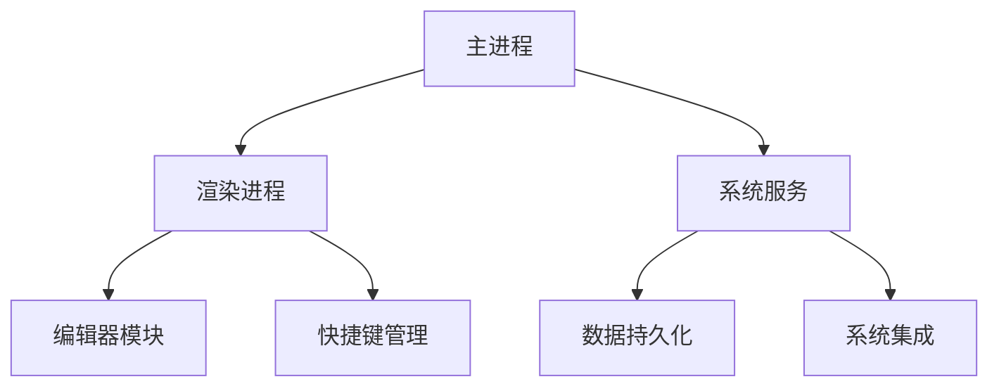

# StellarNotes ✨

[](https://vuejs.org/)
[](https://www.typescriptlang.org/)
[](https://vitejs.dev/)


跨平台科幻风格效率工具，融合暗物质美学与流体交互体验。[[下载体验]](https://example.com) | [[在线演示]](https://demo.example.com)


## ✨ 核心特性

### 🚀 次世代界面
- **赛博光效系统**  
  动态霓虹边框、粒子背景与CSS 3D变换打造沉浸式视觉体验
  ```css
  .neon-card {
    box-shadow: 0 0 10px #00D4FF, 
                0 0 20px #FF00D4,
                inset 0 0 15px rgba(0,212,255,0.2);
  }
  ```

### ⚡ 极致性能
| 指标                | 数值           | 优化方案                  |
|---------------------|----------------|--------------------------|
| 冷启动时间          | <1.2s          | Vite代码分割 + 预加载     |
| 内存占用            | <120MB         | 虚拟滚动 + WASM加速       |
| 交互响应延迟        | <30ms          | Web Worker并行处理        |

### 🎮 智能交互
- **全息投影编辑器**  
  支持Markdown实时渲染与全息投影式图片插入
  ```ts
  const insertHologram = (imgData: string) => {
    applyHologramEffect(imgData) // WebGL滤镜处理
    editor.value?.insertContent(imgData)
  }
  ```

## 🛠️ 快速开始

### 环境要求
- Node.js 18+
- PNPM 8.x

### 安装步骤
```bash
# 克隆仓库
git clone https://github.com/yourname/stellar-notes.git

# 安装依赖
pnpm install

# 开发模式
pnpm dev

# 生产构建
pnpm build
```

## 🎨 主题定制

通过修改CSS变量实现视觉系统深度定制：
```scss
// src/styles/theme.scss
:root {
  --st-deep-space: #0A192F; // 主背景色
  --st-neon-pulse: 2s infinite pulse; // 动态光效
}

@keyframes pulse {
  0%, 100% { opacity: 0.8; }
  50% { opacity: 0.3; }
}
```

## 📦 模块架构


## 🤝 参与贡献
1. Fork本仓库
2. 创建特性分支 (`git checkout -b feature/amazing-feature`)
3. 提交更改 (`git commit -m 'Add some feature'`)
4. 推送分支 (`git push origin feature/amazing-feature`)
5. 发起Pull Request

## 📜 许可协议
[MIT License](LICENSE) © 2023 Your Name

---

> **星际导航**  
> 需要帮助？[查看完整文档](docs/) | [报告问题](https://github.com/yourname/stellar-notes/issues)
